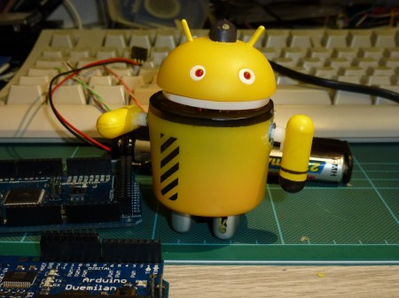

# Android androids
<date>2011-07-20</date>

Meet Arnie Android (rev0)

Based on a desk toy from Dealextreme he as 2 servo driven arms,a buzzer
two flashy eyes and a PIR sensor in the head. Those foolish enough to
approach within 10 M of my desk can now be detected ans suitably
"processed" by Arnie ;)

http://www.dealextreme.com/p/android-mini-collectible-series-action-figure-doll-android-09-yellow-51733

Designed by yours truly as a fun way to develop programs for both
Arduinos and Linux expect Arnie to "be back" soon as further
developments are made!

Hasta la vista,

John Alexander of Shropshire Linux User Group
(http://shropshirelug.wordpress.com/)
