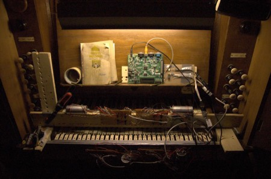

# Music Hack Night, November 18th!
<date>2011-11-11</date>

> 
>
> The Waldflöte pictured is an old church organ that was repaired
and automated by Dorkbot Alba, a forerunner to the Edinburgh
Hacklab.

Next week, November 18th, we will be trying out a music hackers' night
at the Edinburgh Hacklab.  This night is aimed at anyone who wants to
make ingenious noises somehow.  Crafts, software, electronics,
philosophy, whatever you're into that is hacky and musicky.  There's no
fixed agenda, meet us and help us choose a direction for this
fabulous-sounding new night!

We'll be kicking off at around 8 although the doors will be open for a
while before.  Bring your ideas, your hacks, the tuba you made out of
ikea packaging, and your hacking spirit.
