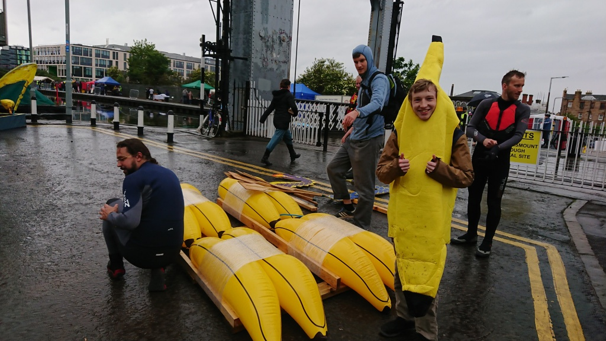
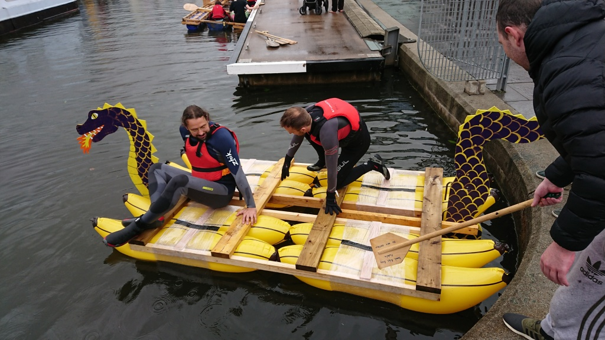
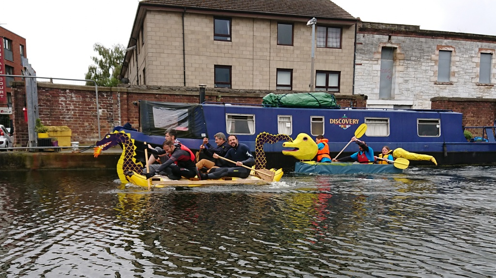
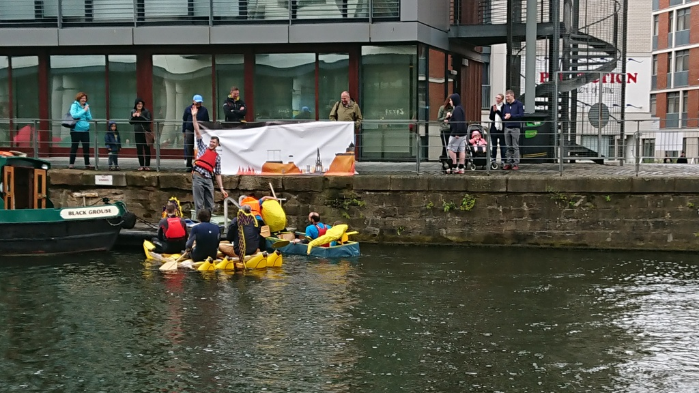

# Edinburgh Hacklab goes bananas at the Union Canal Raft Race
<date>2018-06-17</date>

Our warriors of the water have defeated our arch rivals, The Forge (and
several small children) to power to victory at the annual canal raft
race. In a fine display of water-craftmanship, our team paddled our fine
creation Dragonana through three heats to glorious win. With the rain
lashing down, and The Forge's 10 metre long raft a constant companion,
it was by no means an easy win. Even the canal's own swan racing team
put up fine competition and were in the lead for much of the first heat.

Here's the first heat as it happened:

https://www.youtube.com/watch?v=FNvDBphd1HA

Team Hacklab lost the second heat to children in a duck, but were not
deterred. Our intrepid team managed to fight off the Forge (despite
their dirty racing tactics) and the duck-kids, to savagely wrench the
winners whistle from the hands of the youth and blow for Hacklab.

Dragonana was brought to you by Martin, Costa, Mike, Miron, Al, Tim (and
others) and "turns up last minute to take the glory" Bart. Thanks to
everyone who braved the weather, see you next year!
